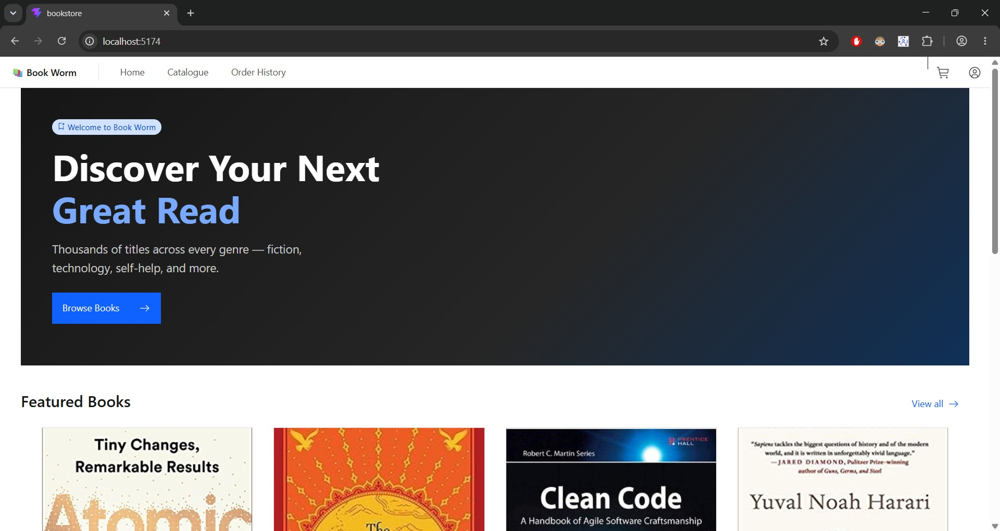
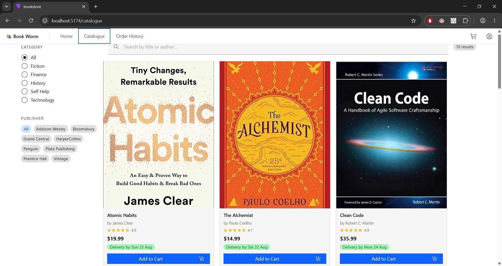
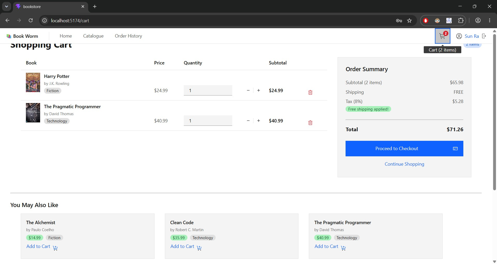
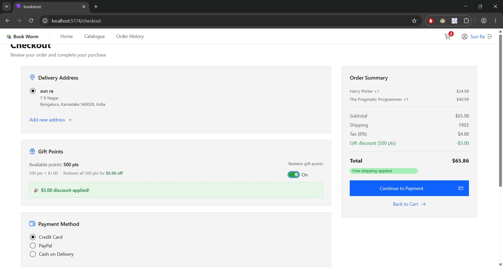
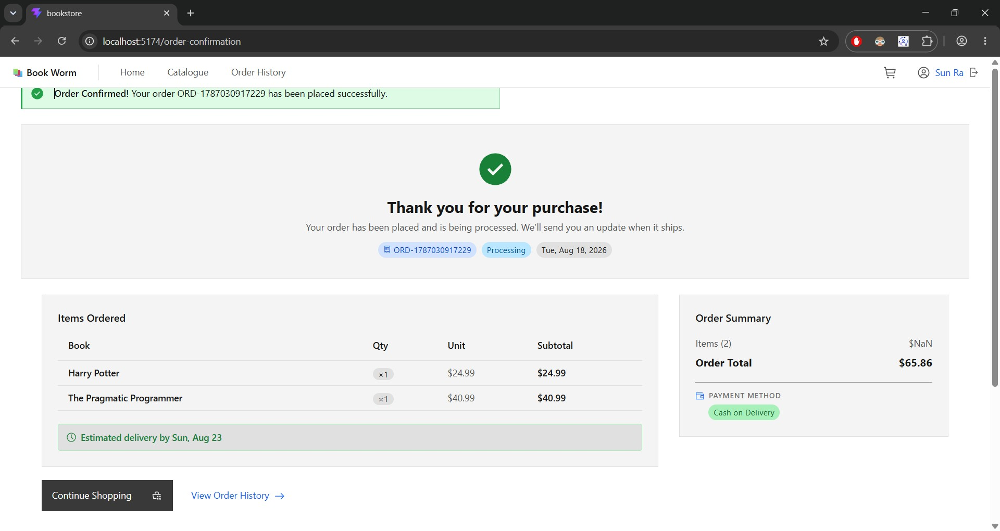
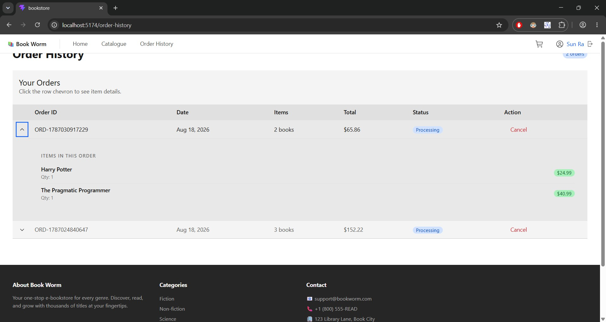

# 📚 BookWorm — Online Bookstore

A full-stack bookstore web application built with **React + IBM Carbon Design System** (frontend) and **Node.js + Express + PostgreSQL** (backend).

---

## ✨ Features

- 🔐 User registration & login with JWT authentication
- 📚 Book catalogue with search, category & brand filters
- 🛒 Shopping cart with quantity management
- 📦 Checkout with address management & gift points redemption
- ✅ Order confirmation & order history
- ❌ Order cancellation (within 48-hour window)
- 🎁 Gift points system (500 pts on signup = $5 discount)

---

## 🖼️ Screenshots

| Home | Catalogue |
|------|-----------|
|  |  |

| Cart | Checkout |
|------|----------|
|  |  |

| Order Confirmation | Order History |
|--------------------|---------------|
|  |  |

---

## 🛠️ Tech Stack

| Layer     | Technology |
|-----------|------------|
| Frontend  | React 19, IBM Carbon Design System, Vite |
| Backend   | Node.js, Express |
| Database  | PostgreSQL |
| Auth      | JWT + bcrypt |
| Testing   | Jest + Supertest |

---

## 🚀 Getting Started

### Prerequisites
- Node.js 18+
- PostgreSQL 14+

### 1. Clone the repo
```bash
git clone https://github.com/sunilbs9207-byte/bookstore-bookworm.git
cd bookstore-bookworm
```

### 2. Set up the database
```bash
# Create DB and user
psql -U postgres -c "CREATE USER bookstore_user WITH PASSWORD 'bookstore123';"
psql -U postgres -c "CREATE DATABASE bookstore_db OWNER bookstore_user;"
psql -U postgres -d bookstore_db -c "GRANT ALL PRIVILEGES ON ALL TABLES IN SCHEMA public TO bookstore_user;"
psql -U postgres -d bookstore_db -c "GRANT ALL PRIVILEGES ON ALL SEQUENCES IN SCHEMA public TO bookstore_user;"

# Load schema + seed data
psql -U bookstore_user -d bookstore_db -f bookstore-backend/schema.sql
```

### 3. Configure environment variables
```bash
cp bookstore-backend/.env.example bookstore-backend/.env
# Edit .env with your values
```

### 4. Start the backend
```bash
cd bookstore-backend
npm install
npm run dev
# Running on http://localhost:5000
```

### 5. Start the frontend
```bash
cd bookstore
npm install
npm run dev
# Running on http://localhost:5173
```

---

## 🔑 Environment Variables

Create `bookstore-backend/.env` based on the example below:

```env
DB_HOST=localhost
DB_PORT=5432
DB_NAME=bookstore_db
DB_USER=bookstore_user
DB_PASSWORD=bookstore123
PORT=5000
JWT_SECRET=your_secret_key_here
JWT_EXPIRES_IN=7d
NODE_ENV=development
```

---

## 🧪 Running Tests

```bash
cd bookstore-backend
npm test                        # run all tests
npx jest tests/auth.test.js     # run a single test file
npm run test:coverage           # coverage report
```

> Tests require a running PostgreSQL instance using the credentials in `.env.test`.

---

## 📁 Project Structure

```
bookstore-bookworm/
├── bookstore/               # React frontend (Vite)
│   ├── src/
│   │   ├── components/      # Navbar, BookCard, etc.
│   │   ├── pages/           # Home, Catalogue, Cart, Checkout, etc.
│   │   ├── services/        # API service functions
│   │   └── context/         # CartContext (global state)
│   └── package.json
│
└── bookstore-backend/       # Express API
    ├── src/
    │   ├── controllers/     # Auth, Books, Cart, Orders, Addresses
    │   ├── routes/          # Express routers
    │   ├── middleware/       # JWT auth middleware
    │   └── config/          # DB connection
    ├── tests/               # Jest + Supertest test suites
    ├── schema.sql           # DB schema + seed data
    └── package.json
```

---

## 🗄️ Database Schema

```
┌─────────────┐       ┌─────────────┐       ┌─────────────┐
│    users    │       │  categories │       │   brands    │
│─────────────│       │─────────────│       │─────────────│
│ id (PK)     │       │ id (PK)     │       │ id (PK)     │
│ name        │       │ name        │       │ name        │
│ email       │       └─────────────┘       └─────────────┘
│ password_   │              │                     │
│   hash      │              │                     │
│ gift_points │       ┌──────▼─────────────────────▼──────┐
│ created_at  │       │              books                 │
└──────┬──────┘       │────────────────────────────────────│
       │              │ id (PK)                            │
       │              │ title, author, price               │
       │              │ image_url, rating, stock           │
       │              │ delivery_days                      │
       │              │ category_id (FK) · brand_id (FK)   │
       │              └───────────────┬────────────────────┘
       │                              │
       ├──────────────────────────────┤
       │                              │
┌──────▼──────┐              ┌────────▼────────┐
│  addresses  │              │      cart       │
│─────────────│              │─────────────────│
│ id (PK)     │              │ id (PK)         │
│ user_id(FK) │              │ user_id (FK)    │
│ name, line1 │              │ book_id (FK)    │
│ city, state │              │ quantity        │
│ zip, country│              │ added_at        │
│ is_default  │              └─────────────────┘
└──────┬──────┘
       │
┌──────▼──────┐       ┌─────────────────────┐
│   orders    │       │    order_items      │
│─────────────│       │─────────────────────│
│ id (PK)     │◄──────│ id (PK)             │
│ user_id(FK) │       │ order_id (FK)       │
│ address_id  │       │ book_id (FK)        │
│ payment_    │       │ title, quantity     │
│   method    │       │ price               │
│ subtotal    │       └─────────────────────┘
│ gift_disc.  │
│ total       │
│ status      │
│ created_at  │
└─────────────┘
```

**Key design decisions:**
- `orders.id` is a `VARCHAR` string (`ORD-<timestamp>`), not a serial integer
- `cart` has a `UNIQUE(user_id, book_id)` constraint — adding same book increments quantity
- `gift_points`: 100 pts = $1 discount; new users start with 500 pts
- Order cancellation restores book stock and is limited to a 48-hour window

---

## 📖 API Reference

See [`bookstore-backend/openapi.yaml`](bookstore-backend/openapi.yaml) for the full OpenAPI specification.

---

## 📄 License

MIT
